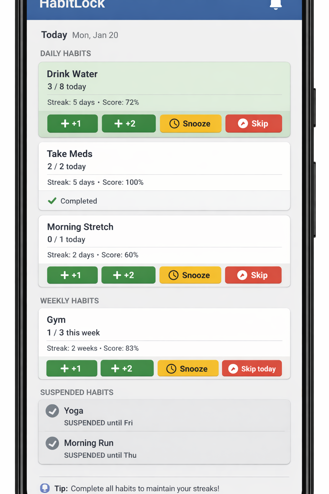

# 🔒 HabitLock

**HabitLock** is an open-source habit tracker that enforces commitments through user-defined strictness levels. Unlike typical habit trackers focused on motivation and gentle reminders, HabitLock helps you keep promises to yourself by providing real accountability with configurable enforcement rules.

> ⚠️ **Work in progress.** Core business logic and Android notifications are implemented. UI polish, full iOS support, and comprehensive testing are ongoing — see [ROADMAP.md](./ROADMAP.md).

---

## Screenshots

| Today | (more coming) |
|-------|--------------|
|  | |

---

## What Makes HabitLock Different

- **Enforcement-based design** — the app actively prevents you from breaking your own rules
- **Conscious strictness** — choose between Flexible, Balanced, or Locked modes; change anytime
- **No gamification clutter** — focused on actual habit completion, not XP or achievements
- **Privacy-first** — local-only storage, no backend sync required

---

## Features

### Implemented
- ✅ Daily and weekly habit tracking (binary and quantitative)
- ✅ Configurable strictness presets (Flexible / Balanced / Locked)
- ✅ Streak tracking per habit and perfect-day streaks
- ✅ Habit Score — cumulative long-term performance metric
- ✅ Skip management with configurable limits
- ✅ Undo policies (none / today only / full history)
- ✅ Snooze functionality with configurable limits and duration
- ✅ Leave / Suspension mode for planned breaks
- ✅ Over-completion tracking (reflected in Habit Score)
- ✅ Timezone-aware day boundaries
- ✅ Notification system with inline actions (+1, Snooze, Skip)
- ✅ Background scheduling (WorkManager + AlarmManager)
- ✅ Calendar screen with day classification (Perfect, Partial, Failed, etc.)
- ✅ Onboarding flow (Philosophy → Strictness → First Habit)
- ✅ Habit creation / editing form

### In Progress / Deferred
- 🔲 iOS activation
- 🔲 Settings screen (strictness switching, snooze/skip limits UI)
- 🔲 Leave mode UI (date picker, swipe actions)
- 🔲 Day-detail calendar view
- 🔲 Multiple notification times per habit
- 🔲 Comprehensive test coverage

---

## Technical Stack

**Platform:** Kotlin Multiplatform targeting Android, iOS, and Desktop (JVM)

| Layer | Technology |
|-------|-----------|
| UI | Compose Multiplatform (Material 3) |
| State | MVVM with `StateFlow` |
| DI | [kotlin-inject](https://github.com/evant/kotlin-inject) (compile-time, KSP) |
| Database | [SQLDelight 2.x](https://cashapp.github.io/sqldelight/) |
| Background | WorkManager + AlarmManager (Android) |
| Async | Kotlin Coroutines & Flow |
| Navigation | Manual `Route` sealed interface (Navigation Component 3 migration planned) |

---

## Architecture

Clean Architecture with vertical feature slices:

```
commonMain/
└── com.ricardocosteira.habitlock/
    ├── di/                  # kotlin-inject component & modules
    ├── domain/
    │   ├── models/          # Pure Kotlin data classes
    │   ├── repositories/    # Repository interfaces
    │   └── usecases/        # Business logic
    ├── data/
    │   ├── database/        # SQLDelight generated sources
    │   ├── mappers/         # DB entity ↔ domain model
    │   └── repositories/    # Repository implementations
    └── presentation/
        ├── navigation/      # Route definitions & NavHost
        └── ui/              # Screen composables & ViewModels

androidMain/
└── com.ricardocosteira.habitlock/
    ├── notifications/       # Channels, manager, receivers
    └── workers/             # WorkManager workers
```

**Data flow:** `Composable → ViewModel → Use Case → Repository → SQLDelight`

---

## Getting Started

### Prerequisites

- Android Studio Meerkat (2024.3.1) or later
- JDK 17+
- Xcode 16+ (for iOS)

### Build and Run — Android

```shell
./gradlew :composeApp:assembleDebug
```

Or use the **Run** configuration in Android Studio / IntelliJ IDEA.

### Build and Run — Desktop (JVM)

```shell
./gradlew :composeApp:run
```

### Build and Run — iOS

Open `iosApp/iosApp.xcodeproj` in Xcode and run on a simulator or device.

Alternatively, use the **iosApp** run configuration in Fleet or Android Studio.

---

## Project Documentation

| Document | Description |
|----------|-------------|
| [ROADMAP.md](./ROADMAP.md) | Phase-by-phase development plan with status |
| [docs/specs/SPEC_v2.md](./docs/specs/SPEC_v2.md) | Complete MVP specification (authoritative) |
| [docs/specs/SPEC_CADENCE_AND_LEAVE.md](./docs/specs/SPEC_CADENCE_AND_LEAVE.md) | Cadence and leave mode details |
| [docs/specs/onboarding_spec.md](./docs/specs/onboarding_spec.md) | Onboarding flow copy and logic |

---

## Contributing

Contributions are welcome! The project is still reaching MVP, so the best ways to help are:

1. **Pick up a task from the roadmap** — anything marked `🔲` or `[ ]` in [ROADMAP.md](./ROADMAP.md)
2. **Write tests** — Phase 5 in the roadmap has a full list of untested use cases
3. **iOS support** — activating the iOS target and wiring the entry point is a good first task
4. **File issues** — bug reports and feature suggestions via GitHub Issues

### Code Style

- Kotlin with strict typing (no `Any`, no wildcard imports)
- Clean Architecture boundaries (domain layer has zero Android/platform imports)
- Given-When-Then test convention
- See the inline Kotlin guidelines in the codebase for naming conventions

---

## License

[MIT License](./LICENSE) — © 2026 Ricardo Costeira
