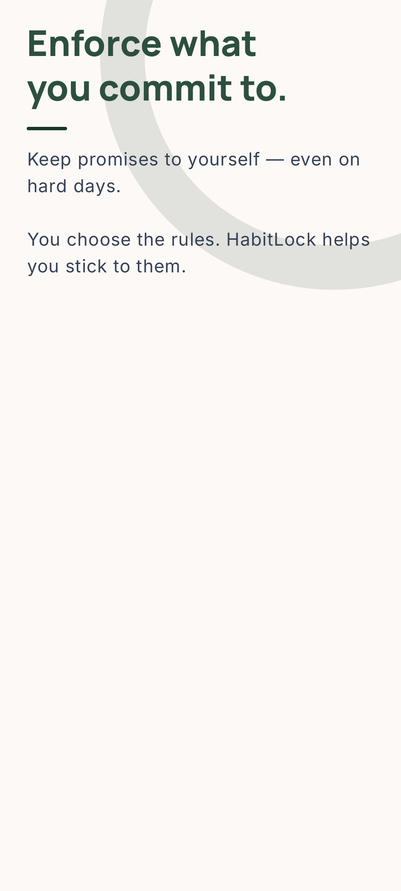
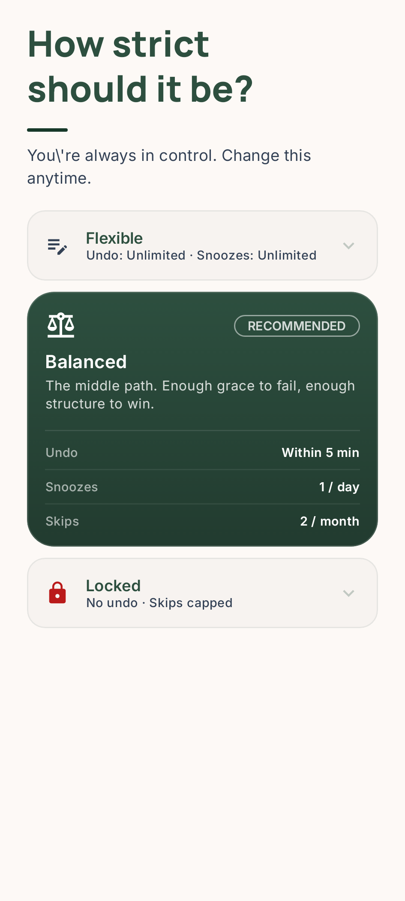
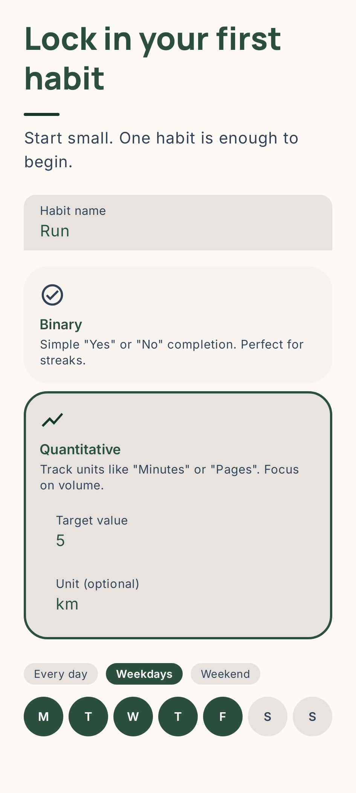
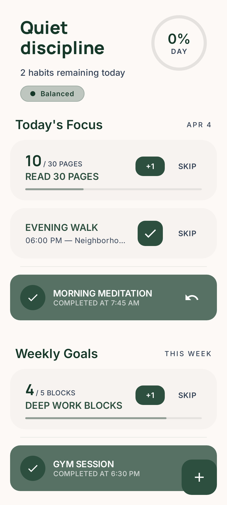
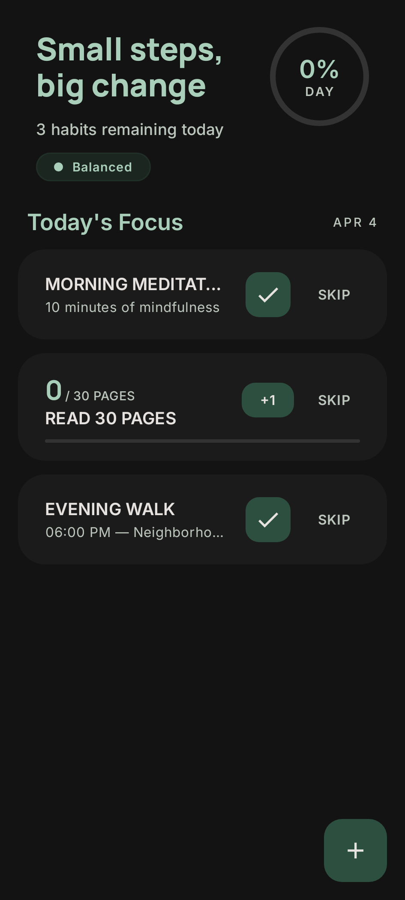
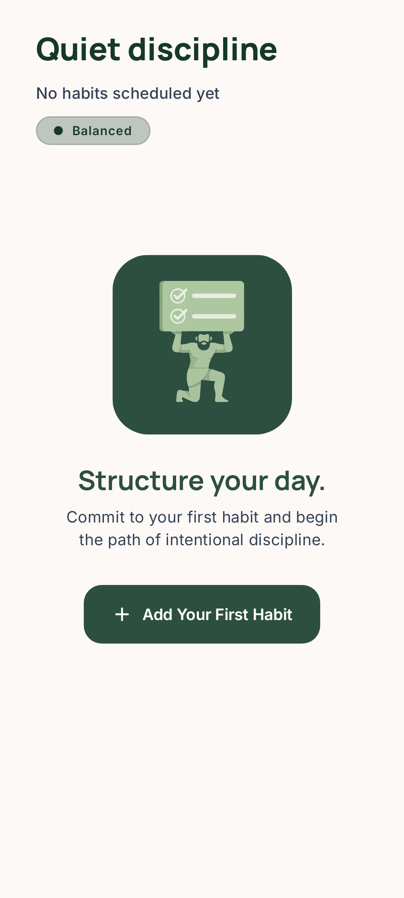
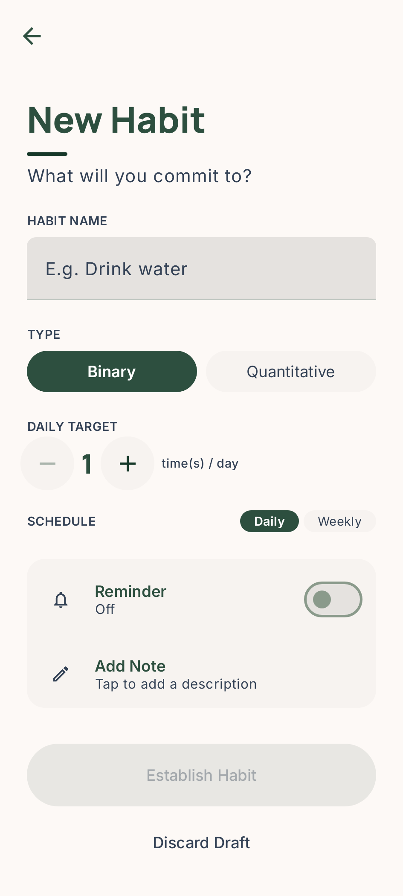
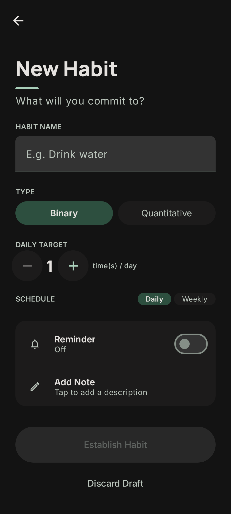

# HabitLock

An open-source habit tracker that enforces commitments through user-defined strictness levels. Unlike typical habit trackers focused on motivation and gentle reminders, HabitLock helps you keep promises to yourself through configurable accountability rules.

> MVP complete for Android. iOS and Desktop targets compile but are not yet activated.

---

## What Makes HabitLock Different

- **Enforcement-based design** — the app actively prevents you from breaking your own rules
- **Conscious strictness** — choose between Flexible, Balanced, or Locked modes; change anytime
- **No gamification clutter** — focused on actual habit completion, not XP or achievements
- **Privacy-first** — local-only storage, no backend sync required

---

## Screenshots

<p align="center">
  
  
  
</p>

<p align="center">
  
  
  
</p>

<p align="center">
  
  
</p>

---

## Features

### Implemented

- Daily and weekly habit tracking (binary and quantitative)
- Configurable strictness presets (Flexible / Balanced / Locked)
- Streak tracking per habit and perfect-day streaks
- Habit Score — cumulative long-term performance metric
- Skip management with configurable limits
- Undo policies (none / today only / full history)
- Snooze functionality with configurable limits and duration
- Leave / Suspension mode for planned breaks
- Over-completion tracking (reflected in Habit Score)
- Timezone-aware day boundaries
- Notification system: reminders with inline actions (+1, Snooze, Skip)
- Persistent tracking notification: monitor progress and complete habits from the notification shade
- Background scheduling (WorkManager + AlarmManager)
- Runtime notification permission handling (Android 13+)
- Calendar screen with day classification (Perfect, Partial, Failed, etc.)
- Onboarding flow (Philosophy, Strictness, First Habit)
- Habit creation / editing with reminders and tracking toggle
- Swipe actions on habit cards (edit / delete with undo)
- Screenshot tests (Roborazzi) for onboarding, today screen, and habit form
- CI pipeline (GitHub Actions)

### Planned

**Post-MVP polish:**
- Day-detail calendar view (tap a day to see that day's habits)
- Leave/suspension mode UI (domain logic complete, needs UI entry point)
- Notification permission onboarding screen
- Habit form IME handling (keyboard occludes bottom buttons)
- Animated collapsing toolbar transition on Today screen

**Future features:**
- Weekly Reflection / insights card (exploring on-device Gemma 4 E2B for natural language summaries)
- Periodic reminder scheduling (interval-based within a time window)
- Create/edit habit UI for custom increment values
- Active vs silent tracking notification toggle in Settings
- iOS activation
- Comprehensive unit test coverage

---

## Technical Stack

**Platform:** Kotlin Multiplatform targeting Android, iOS, and Desktop (JVM)

| Layer | Technology |
|---|---|
| UI | Compose Multiplatform (Material 3) |
| State | MVVM with `StateFlow` |
| DI | [kotlin-inject](https://github.com/evant/kotlin-inject) (compile-time, KSP) |
| Database | [SQLDelight 2.x](https://cashapp.github.io/sqldelight/) |
| Background | WorkManager + AlarmManager (Android) |
| Async | Kotlin Coroutines & Flow |
| Navigation | Navigation Component 3 |
| Screenshot tests | [Roborazzi](https://github.com/takahirom/roborazzi) + Robolectric |

---

## Architecture

Clean Architecture with vertical feature slices:

```
commonMain/
└── com.ricardocosteira.habitlock/
    ├── di/                  # kotlin-inject component & modules
    ├── domain/
    │   ├── models/          # Pure Kotlin data classes
    │   ├── repositories/    # Repository interfaces
    │   └── usecases/        # Business logic
    ├── data/
    │   ├── database/        # SQLDelight generated sources
    │   ├── mappers/         # DB entity <-> domain model
    │   └── repositories/    # Repository implementations
    ├── notifications/       # HabitNotification expect/actual interface
    └── presentation/
        ├── navigation/      # Route definitions & NavHost
        └── ui/              # Screen composables & ViewModels

androidMain/
└── com.ricardocosteira.habitlock/
    ├── notifications/       # Channels, scheduler, receivers, tracking
    └── workers/             # WorkManager workers
```

**Data flow:** `Composable -> ViewModel -> Use Case -> Repository -> SQLDelight`

---

## Getting Started

### Prerequisites

- Android Studio Meerkat (2024.3.1) or later
- JDK 17+
- Xcode 16+ (for iOS)

### Build and Run — Android

```shell
./gradlew :composeApp:assembleDebug
```

Or use the **Run** configuration in Android Studio / IntelliJ IDEA.

### Build and Run — Desktop (JVM)

```shell
./gradlew :composeApp:run
```

### Build and Run — iOS

Open `iosApp/iosApp.xcodeproj` in Xcode and run on a simulator or device.

---

## Running Tests

### Unit tests

```shell
./gradlew :composeApp:testDebugUnitTest
```

### Screenshot tests (Roborazzi)

Record / update goldens:

```shell
./gradlew :composeApp:recordRoborazziDebug
```

Verify against goldens (used in CI):

```shell
./gradlew :composeApp:verifyRoborazziDebug
```

Golden images are stored in `composeApp/src/androidUnitTest/snapshots/images/` and committed to the repository. Screenshots are captured at **360x800 dp / 420 dpi**, matching the most common Android device size.

---

## Contributing

Contributions are welcome. The best ways to help:

1. **Pick up a planned feature** — anything in the Planned section above
2. **Write tests** — there are many untested use cases
3. **iOS support** — activating the iOS target and wiring the entry point
4. **File issues** — bug reports and feature suggestions via GitHub Issues

### Code Style

- Kotlin with strict typing (no `Any`, no wildcard imports)
- Clean Architecture boundaries (domain layer has zero Android/platform imports)
- Given-When-Then test convention

---

## License

[MIT License](./LICENSE) — © 2026 Ricardo Costeira
